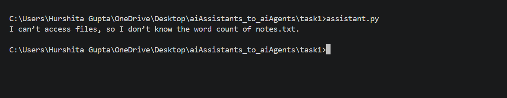

# Task 1 — The Stateless Baseline

## Deliverable 1 — assistant.py and printed output

### assistant.py

The implementation is available in `assistant.py`.

### Printed Output 
I can’t access files, so I don’t know the word count of notes.txt.

## Deliverable 2 — missing capability

The missing capability is **tools**: the assistant has no mechanism
to access or read `notes.txt`. Without tools, it cannot perform the
file-reading and word-counting actions required to answer the question.