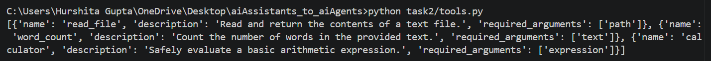
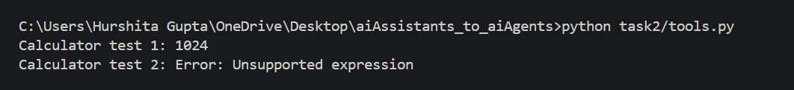

# Task 2 — Tools with Real Schema

## Deliverable 3 — tools.py and describe_tools() output 

### tools.py

The implementation is available in `tools.py`.
Implemented the following tools:

- `read_file(path)` — reads and returns file contents.
- `word_count(text)` — counts words in the provided text.
- `calculator(expression)` — safely evaluates supported arithmetic expressions using AST.

### describe_tools() output -
```text
[{'name': 'read_file', 'description': 'Read and return the contents of a text file.', 'required_arguments': ['path']}, 
{'name': 'word_count', 'description': 'Count the number of words in the provided text.', 'required_arguments': ['text']}, 
{'name': 'calculator', 'description': 'Safely evaluate a basic arithmetic expression.', 'required_arguments': ['expression']}]
```



## Deliverable 4 — unit test

Calculator test 1: 1024

Calculator test 2: Error: Unsupported expression

