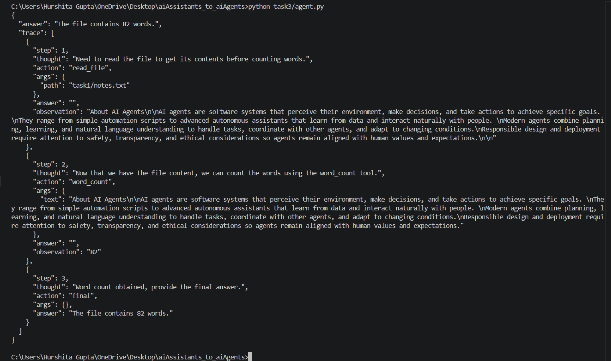

# Task 3 — The Agent Loop

## Deliverable 5 — agent.py solving the notes.txt goal with at least two tool calls. 

### agent.py

The implementation is available in `agent.py`.

The agent was tested with the goal:

> Read task1/notes.txt and count the number of words in it.

The agent completed the goal using two tool calls:

- `read_file(path)` — reads the contents of `task1/notes.txt`
- `word_count(text)` — counts the words in the returned file contents

## Deliverable 6 — printed trace showing thought, action, args, and observation per step.

This shows how does the agent think, act, collect arguments and observe

## Deliverable 7 — Proof MAX_STEPS terminates an unsolvable goal instead of looping forever

To test the step limit, I intentionally used a multi-step calculation that requires more steps than the configured limit:

> Calculate 3+5 first, then calculate 6+7 and after that calculate 8+7. Once you have the answer to all three expressions separately, calculate the sum of all three results and give me the final answer.

For this test, `MAX_STEPS` was set to `4`.

The agent reached the configured step limit before completing the goal and returned the maximum-step termination message instead of continuing indefinitely.

## Deliverable 8 — Comparison of Task 1 and Task 3

In Task 1, the assistant is stateless and has no tools, so when asked about `notes.txt`, it cannot actually read the file or perform an action on it. In Task 3, the agent has tools and an execution loop, allowing it to decide which tool to use, execute the tool, receive the observation, and continue until it reaches a final answer or the MAX_STEPS limit. Therefore, Task 1 demonstrates a basic prompt-completion assistant, while Task 3 demonstrates an agent that can take actions and iterate toward a goal.
