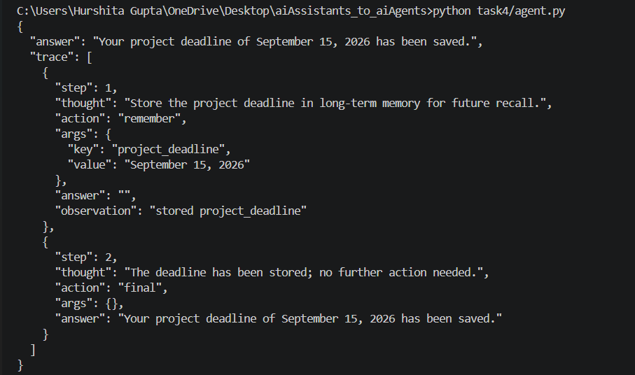
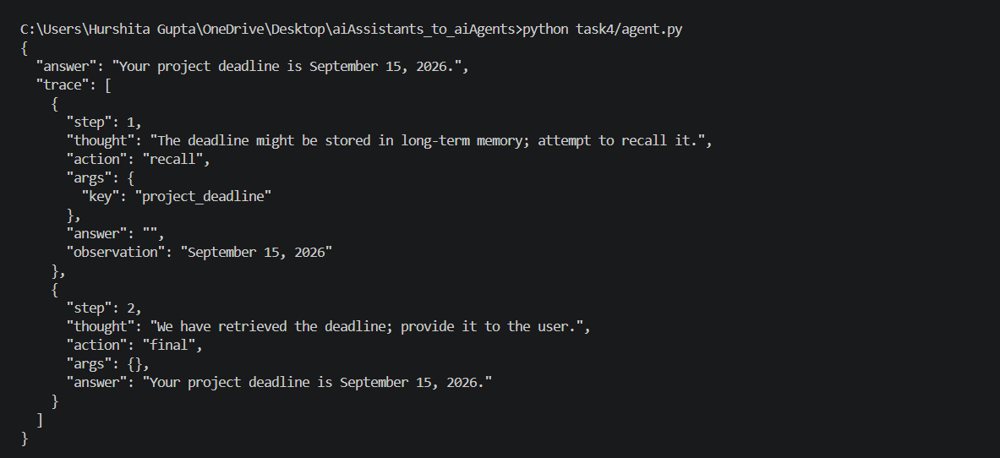
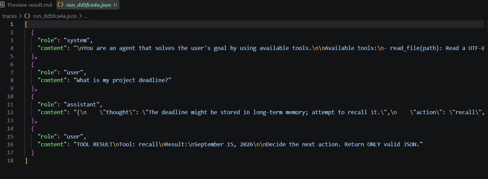

# Task 4 — Memory and State

## Deliverable 9 — remember and recall registered in TOOLS

Implemented remember and recall in memory.py and registered both tools in TOOLS in tools.py.

`remember(key, value)` : stores durable facts in memory.json.

`recall(key)` : retrieves a previously stored fact.


## Deliverable 10 — Transcript A and B

```text
Transcript A:
I told the agent: Remember that my project deadline is September 15, 2026.

The agent selected the remember tool and successfully stored the deadline in memory.json.
```


```text
Transcript B:
I started a new Python process and asked: What is my project deadline?

The agent selected the recall tool and returned: Your project deadline is September 15, 2026.
```



## Deliverable 11 — traces/run_id.json snapshot from a completed run.

A completed run was automatically saved in:

> traces/run_<id>.json

The snapshot contains the history of the run and can be used to replay/inspect what happened during execution.




