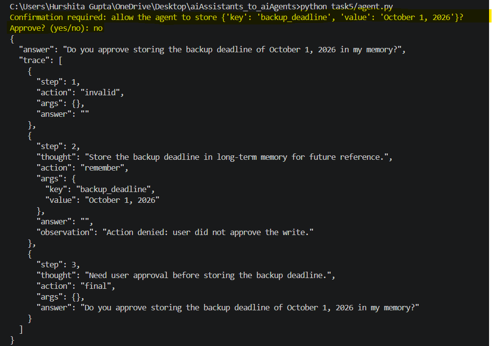
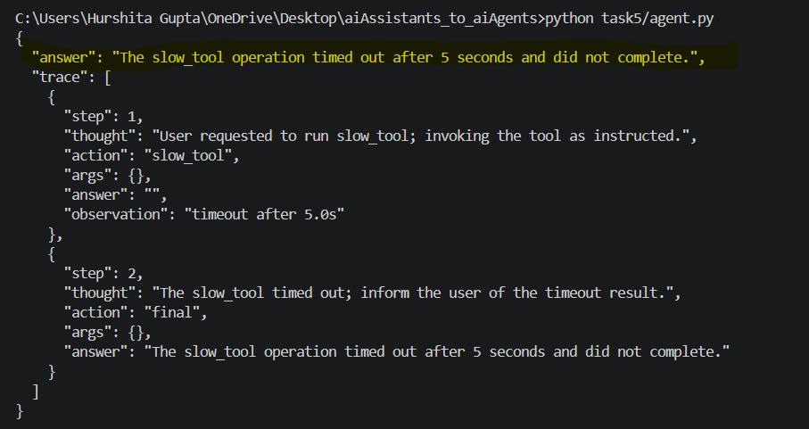
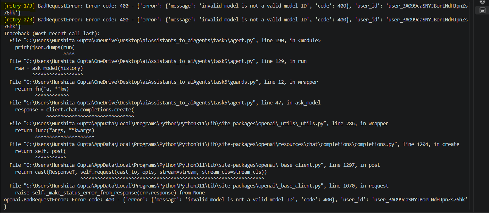
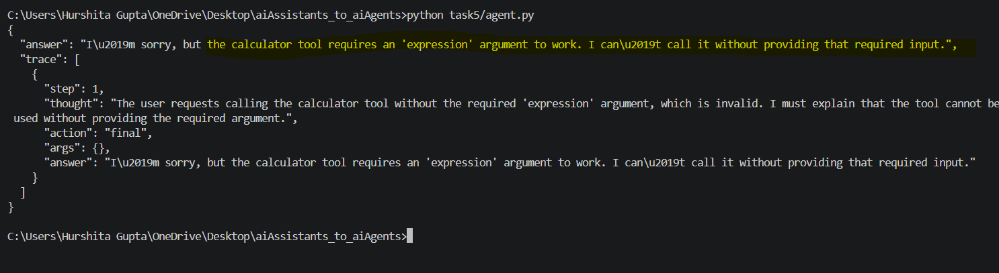
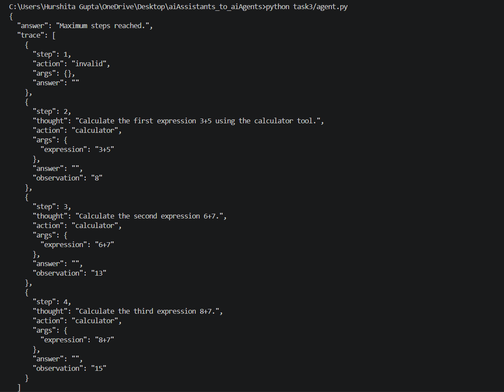
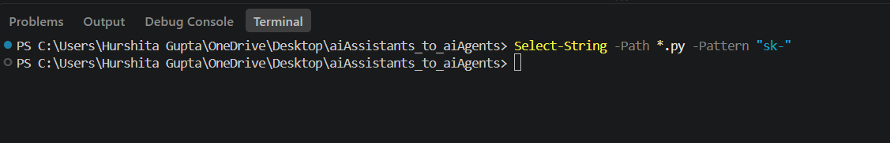

# Task 5 — Robustness and Guardrails

## Deliverable 12 — guards.py wired into the loop

Created guards.py containing retry and timeout controls and integrated them into agent.py.

- Model calls use @with_retry(attempts=3) to retry failed API calls with exponential backoff.
- Tool calls use call_with_timeout(..., seconds=5.0) to prevent a hanging tool from blocking the agent.
- Required tool arguments are validated before execution.
- MAX_STEPS = 4 prevents infinite agent loops.
- Write operations such as remember require explicit user confirmation.


## Deliverable 13 — six log excerpts

```text
Log 1 : Confirmation - Any delete or write requires explicit human 
approval

The remember tool writes durable information to memory.json, so explicit approval is requested before it executes.
```


```text
Log 2 : Timeout - Per-tool timeout so a hanging call cannot block the run.

I temporary created slow_tool that intentionally sleeps for 10 seconds in oreder to check the timeout functionality.
```


```text
Log 3 : Retry- Up to 3 model retries withexponential backoff.

I changed the model configuration temporarily changed to an invalid model name to deliberately cause the model call to fail.
```


```text
Log 4 : Schema Check - Reject tool args missing required keys before invoking.

I tested the agent with a tool request where a required argument was unavailable/missing.
```


```text
Log 5 : Step Limit - Hard cap on loop iterations(MAX_STEPS).

I tested the agent with a multi-step calculation requiring more actions than the allowed step limit.
```


```text
Log 6 : Secret Hygiene - Keys read only from environment variables.

I performed a source-code search for sk- in PowerShell and it returned no matches, demonstrating that no API key was present in the Python source files.
```



