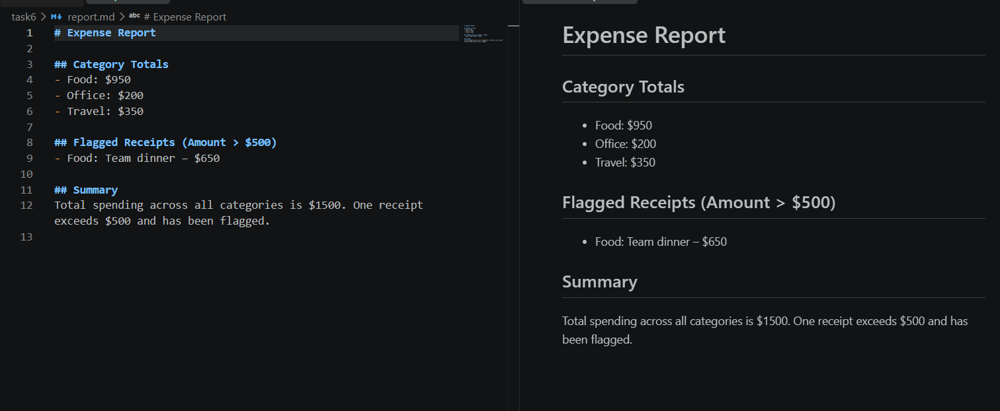
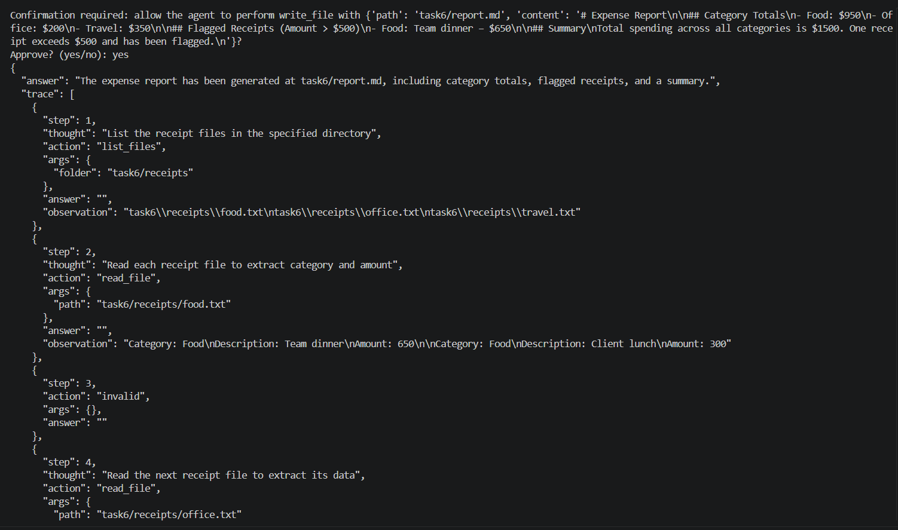
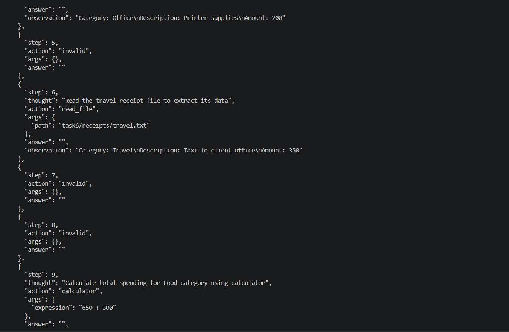
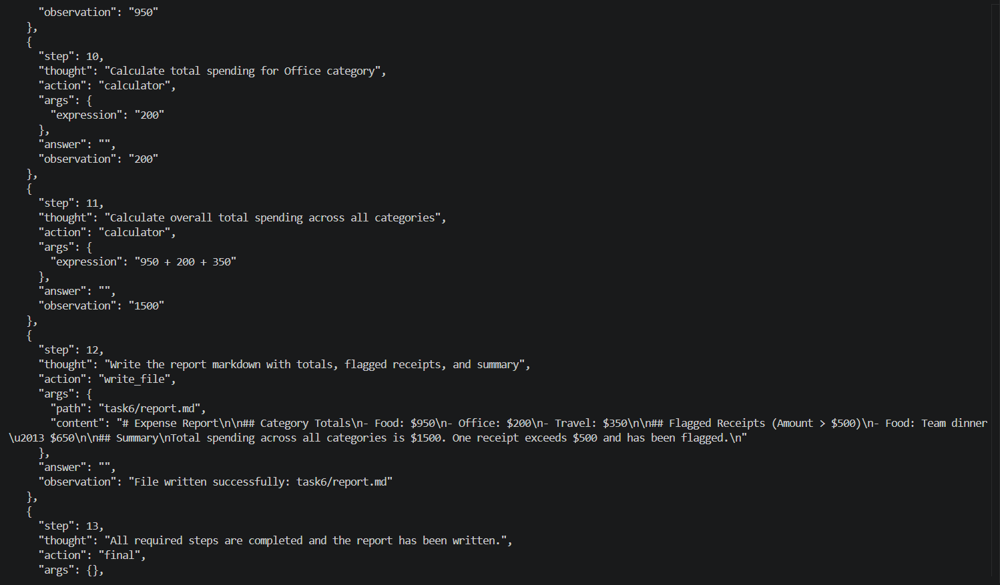

# Task 6 — Real World Scenario

> Scenario A — Expense Triage

For Task 6, I implemented the Expense Triage scenario.

The agent reads plain-text receipt files from the task6/receipts folder, identifies the category and amount of each expense, calculates category totals, flags receipts over $500, and generates a final report.md file.

The agent uses multiple tools during this process:

`list_files` — discovers the receipt files.

`read_file` — reads each receipt.

`calculator` — calculates category and overall totals.

`write_file` — generates the final expense report.

The existing agent loop and Task 5 guardrails are reused, including the step limit, timeout, schema validation, and confirmation before writing a file.

## Deliverable 14 — Scenario Script and Generated Artefact

The scenario is executed using:

`python task6/scenario.py`

The agent successfully processes the receipts and generates:

`task6/report.md`

The generated report contains:

Total spending per category.
Receipts with an amount greater than $500.
A short summary of the expenses.

Example results from the generated report:




## Deliverable 15 — Full Trace of a Successful Run

```text
The trace of the agent run is available in:  traces/run_95fa684a.json
```




## Deliverable 16 — Failure Case and Fix

> Failure

During the Expense Triage scenario, the model occasionally returned malformed JSON instead of a single valid JSON object. In some responses, it added explanatory text before the JSON, and in others it returned multiple JSON objects in the same message.

Because the agent uses json.loads() to parse the model output, these responses could not be parsed. As a result, the agent marked the step as invalid and did not execute the requested tool for that iteration.

> Fix

To improve reliability, I made the following changes:

Enabled JSON response mode using response_format={"type": "json_object"}.

Strengthened the system prompt to require exactly one valid JSON object with no explanations, Markdown, or multiple objects.

Kept the existing recovery logic: when parsing fails, the agent records the step as invalid, gives corrective feedback to the model, and continues the loop instead of crashing.

Although the free model still produced occasional malformed responses, the recovery mechanism allowed the agent to successfully complete the task


